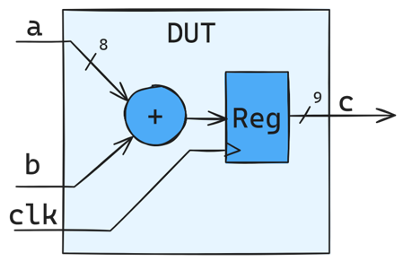
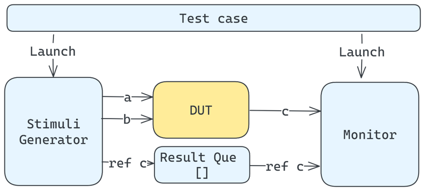

# CocoTB Testbench Demo
This repository contains a simple demo used in a presentation of mine giving a beginner's guide to using CocoTB. The project provides an example of how to use CocoTB for the verification of a simple 8-bit adder.

## Overview
The project contains a simple VHDL design of an 8-bit adder. It contains a test bench using CocoTB with a simple stimuli generator/monitor style. It also contains a test runner example to demonstrate integration with pytest and a classical makefile version, to show the makefile-based flow. You can also find [my presentation](/doc/cocotb_presentation.pdf) under "doc".

Design Under Test:

Testbench Structure:

## Project Structure

The project contains:

- `simple_adder.vhdl`: A VHDL file containing a simple 8-bit adder that we want to test.
- `simple_adder.py`: The test bench file with CocoTB code.
- `Makefile`: Demonstrates the makefile flow to build your test bench.
- `test_runner.py`: Demonstrates the Python runner-based flow to integrate with PyTest.
- `presentation.pdf`: My presentation slides.

## License

This project is licensed under the MIT License. See the LICENSE file for details.

## Contact

For any questions or inquiries, please contact [robin.mueller@fhnw.ch](mailto:robin.mueller@fhnw.ch)
